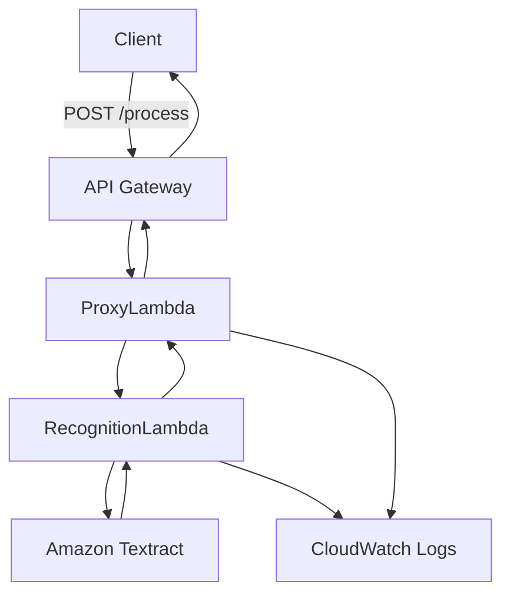

# Car Number Recognition

## A serverless application for recognizing car numbers (license plates) using AWS Lambda and Amazon Textract.

Table of Contents
	•	Overview
	•	Architecture
	•	Setup & Deployment
	•	Usage
	•	Technologies Used
	•	License

## Overview

The Car Number Recognition application allows users to upload an image of a car’s license plate and retrieves the recognized text using Optical Character Recognition (OCR). It leverages AWS Lambda functions and Amazon Textract to provide a scalable and efficient solution.

## Architecture

	•	Client: Sends a POST request with a Base64-encoded image.
	•	API Gateway: Serves as the HTTP endpoint to receive requests.
	•	Lambda1: Validates the input and invokes Lambda2.
	•	Lambda2: Processes the image using Amazon Textract to extract text.
	•	Amazon Textract: Performs OCR to detect and analyze text in the image.
	•	CloudWatch Logs: Logs for monitoring and debugging.

